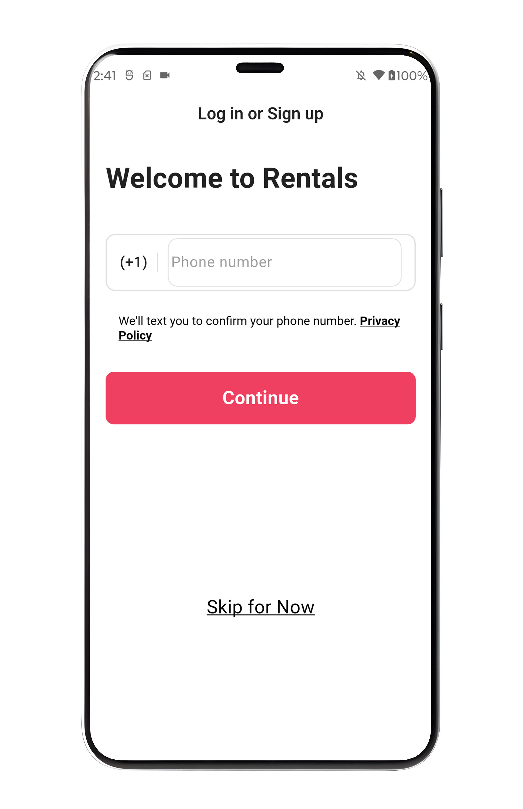
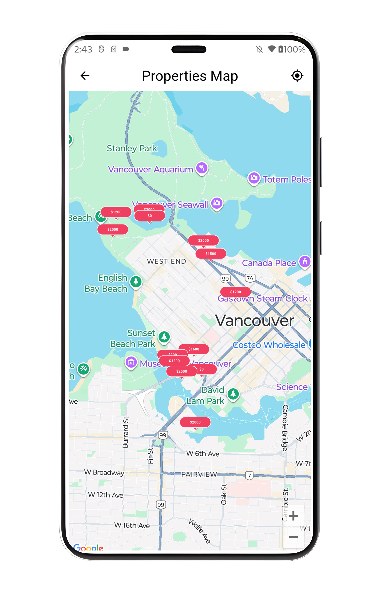
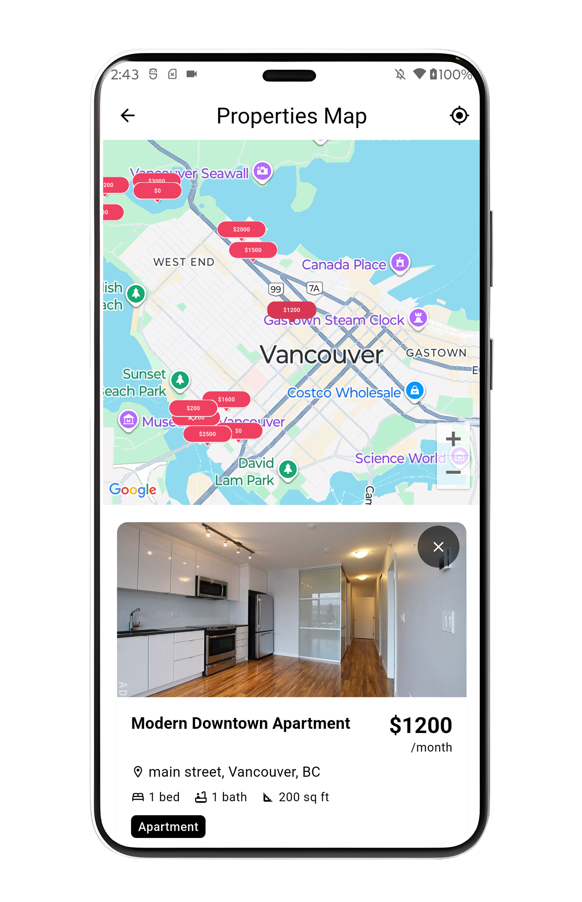

# 🏠 Flutter Property Rental Platform

A property rental management application built with Flutter and Firebase.

## 🎥 Demo Video
[[Link to demo video]](https://youtu.be/z6X_KSavtew)

## 📱 Screenshots

  
  
  
  

## ✨ Key Features
- Dual-mode interface (Renters & Property Hosts)
- Interactive Google Maps with custom markers
- Real-time property availability calendar
- Advanced search and filtering system
- Multi-step property listing wizard
- Firebase integration for authentication and data storage
- Responsive design for mobile, tablet, and web

## 🛠️ Technical Highlights
- **Framework**: Flutter 3.35.1 with Dart
- **Backend**: Firebase (Firestore, Auth, Storage)
- **Maps**: Google Maps Flutter with custom markers
- **State Management**: Provider/Bloc pattern
- **Architecture**: Clean Architecture with MVVM
- **Platforms**: iOS, Android, Web

## 🏗️ Architecture Overview
 MVVM with 14 pages, 7 services, 10 models

## 🔧 Development Process
- Agile development methodology
- Feature-driven development
- Comprehensive testing strategy
- CI/CD pipeline implementation

## 📊 Project Stats
- **Development Time**: 12 weeks
- **Lines of Code**: ~17,000
- **Components Built**: +44 custom widgets
- **Firebase Collections**: 3 collections
- **API Integrations**: Google Maps, Firebase Services

---
*This is a portfolio showcase. Source code is proprietary.*
